<div align="center">



### Claude Code를 21명의 에이전트 팀으로 바꾸는 엔지니어링 하네스

당신은 한 사람과 대화하지 않습니다. **CTO, 설계자, 백엔드, 보안, 디자이너, 검증가** — 역할을 가진 팀과 일합니다.

<br/>

[](https://github.com/burlesquer/deekee-dev-harness)
[](https://claude.com/claude-code)
[](#스펙)
[](LICENSE)

[설치](#설치) · [팀](#에이전트-팀-21명) · [시작하기](#시작하기) · [3D 오피스](#3d-오피스--에이전트-관전) · [스펙](#스펙)

</div>

---

## 무엇인가요

**dk-harness**는 Claude Code 위에 얹는 플러그인입니다. 설치하면 Claude Code가 한 명의 비서가 아니라, **21명의 전문 에이전트로 구성된 팀**처럼 일합니다.

- 🧠 **역할 기반 팀** — 작업을 보고 알맞은 에이전트(설계/구현/보안/리뷰)를 자동 편성
- 📋 **합의형 계획 (DKH-DR)** — 여러 관점이 심의·투표로 계획을 수렴
- 🔒 **증거 강제** — 테스트·빌드 결과 없이는 "완료"를 인정하지 않음
- ♻️ **자가 치유** — 서킷 브레이커 · 재시도 · 롤백 내장
- 🎬 **3D 오피스** — 에이전트가 일하는 모습을 실시간으로 관전 ([라이브](https://office-black-zeta.vercel.app))

자연어로 말하면 됩니다. 명령어를 외울 필요 없어요.

```
로그인 기능 만들어줘
```

---

## 설치

```
/plugin marketplace add burlesquer/deekee-dev-harness
/plugin install dk-harness
```

업데이트:

```
claude plugin update dk-harness@dk-harness-marketplace
```

> **요구사항** — Claude Code v2.1.69+ · Node.js v22+

---

## 에이전트 팀 (21명)

각 에이전트는 고유한 역할 · 성격 · 모델 티어를 가집니다.

#### 리더십 · 심의

| 에이전트 | 역할 | 모델 |
|---|---|:---:|
| **Simon** | CEO / 제품 전략 | `opus` |
| **Sam** | CTO / 리드 | `opus` |
| **Able** | PM / 기획 | `opus` |
| **Klay** | 아키텍트 / 탐색 | `opus` |
| **Ryan** | 심의 퍼실리테이터 | `opus` |
| **Critic** | 심의 비평가 | `opus` |
| **Noah** | 종합 검증가 | `sonnet` |

#### 백엔드 · 인프라

| 에이전트 | 역할 | 모델 |
|---|---|:---:|
| **Jay** | API 개발 | `sonnet` |
| **Jerry** | DB / 인프라 | `sonnet` |
| **Milla** | 보안 / 인증 | `sonnet` |
| **Jun** | 성능 / 최적화 | `sonnet` |
| **Kain** | 코드 인텔리전스 | `sonnet` |

#### 프론트엔드 · 디자인

| 에이전트 | 역할 | 모델 |
|---|---|:---:|
| **Willji** | UI/UX 디자인 | `sonnet` |
| **Derek** | 화면 구현 | `sonnet` |
| **Rowan** | 모션 / 인터랙션 | `sonnet` |
| **figma-reader** | Figma 디자인 해석 | `sonnet` |

#### AI/ML · 특수

| 에이전트 | 역할 | 모델 |
|---|---|:---:|
| **Jo** | AI 구현 시니어 | `sonnet` |
| **Hugg** | AI 모델 리서치 시니어 | `sonnet` |
| **Iron** | 마법사 — 비개발자용 가이드 | `sonnet` |
| **Teacher** | 소크라테스식 학습 | `sonnet` |
| **progress-checker** | 진행/품질 게이트 검증 | `sonnet` |

---

## 시작하기

명령어를 외울 필요 없이 자연어로 말하거나, 상황별 단축 명령을 쓸 수 있습니다.

| 상황 | 명령어 |
|---|---|
| 간단한 수정 | `/dk-harness do "설명"` |
| 새 기능 | `/dk-harness auto 기능명 "설명"` |
| 버그 추적 | `/dk-harness debug "증상"` · `/dk-harness investigate` |
| 코드 리뷰 | `/dk-harness review-pipeline` |
| 보안 감사 | `/dk-harness review cso` |
| 하네스 설계 | `/dk-harness harness "리서치 팀 만들어"` |
| AI 파이프라인 | `/dk-harness ai-pipeline "감성 분석 모델"` |
| 성능 분석 | `/dk-harness perf runtime` |
| PR + 배포 | `/dk-harness ship` → `/dk-harness land-and-deploy` |
| 학습 모드 | `/dk-harness teacher "배우고 싶은 기능"` |
| 비개발자 | `/dk-harness wizard` |
| 실수 복구 | `/dk-harness rollback` |

> 전체 명령어 — [docs/COMMANDS.md](docs/COMMANDS.md) · 초보자 가이드 — [docs/USER-GUIDE.md](docs/USER-GUIDE.md)

---

## 3D 오피스 — 에이전트 관전

하네스가 **엔진**이라면, office는 그 **화면**입니다.

에이전트가 작업할 때마다 훅이 이벤트를 중계(relay)하고, 브라우저의 3D 오피스에 **캐릭터로 등장**해 실시간으로 움직입니다. 코드를 짜는 곳이 아니라, 팀이 일하는 모습을 지켜보는 관제 화면이에요.

🔗 **라이브** — https://office-black-zeta.vercel.app

```
dk-harness (엔진)          office (화면)
에이전트가 "일한다"   →     그 일을 "보여준다"
오케스트레이션              실시간 3D 시각화
```

- Next.js 16 · React Three Fiber 기반
- Claude Code 훅이 세션 시작 시 자동 연동 (별도 설치 불필요)
- 룸 코드(`DK-XXXX`)로 입장·공유, 핵심 10인 로스터가 오피스에 등장

> 소스 — [`office/`](office/)

---

## 핵심 기능

| | |
|---|---|
| **합의형 계획 (DKH-DR)** | 다관점 심의 + 투표로 계획 수렴 |
| **증거 체인** | 6종 증거 — 증거 없으면 "완료" 없음 |
| **적응형 라우팅** | 복잡도(0–15) → haiku / sonnet / opus 자동 선택 |
| **비용 인텔리전스** | 예산 + 상한 + 모델 라우터 |
| **자가 치유** | 서킷 브레이커 + 재시도 + 복구 + 롤백 |
| **4단계 리뷰** | CEO / Eng / Design / Outside Voice |
| **CSO 보안 감사** | OWASP + STRIDE 다단계 |
| **AI Slop 탐지** | 안티패턴 + 리트머스 검사 |
| **멀티 AI 합의** | Claude + Codex + Gemini 3-보이스 투표 |
| **디자인 시스템 엔진** | 토큰 생성/비교/반복/진화/갤러리 |
| **Teacher 모드** | 소크라테스식 질문으로 함께 배우기 |
| **3-Tier Notepad** | 컴팩션을 견디는 우선순위 메모 |

---

## 스펙

| 항목 | 값 |
|---|---|
| 버전 | **2.9.21** |
| 에이전트 | **21명** (역할 · 성격 · 모델 티어) |
| 스킬 | **45개** |
| 혁신 모듈 | **33** |
| 테스트 | **1,454** passing |
| 훅 응답 | **~5ms** |
| 런타임 의존성 | **1** (`@ast-grep/napi`) |
| 라이선스 | **Apache-2.0** |

---

<div align="center">
<sub>Built by <a href="https://github.com/burlesquer">deekee</a> · <a href="https://office-black-zeta.vercel.app">Agent Office</a></sub>
</div>
